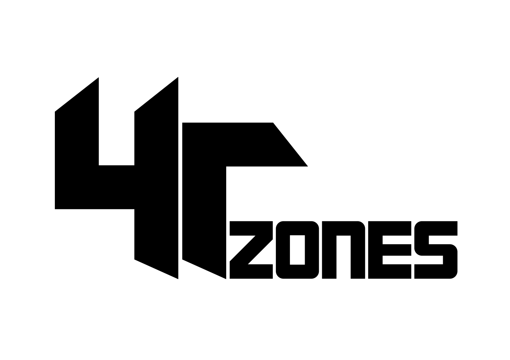
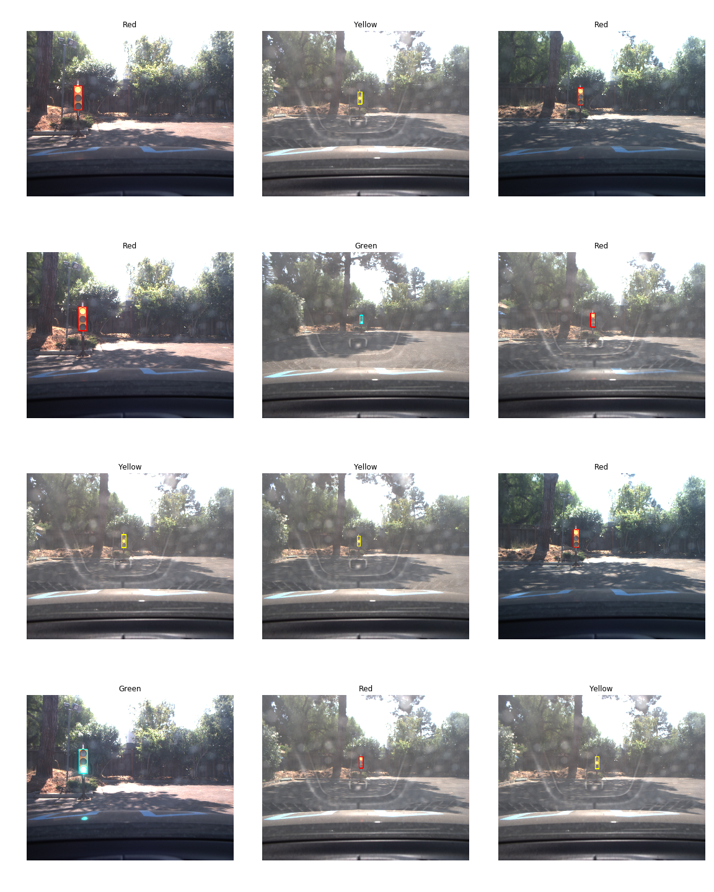

# Self-Driving Car using ROS  
#### Udacity Self-Driving Car Engineer Nanodegree --- Capstone Project


## Team 4Tzones
  

|     Team Member     |            Email             |                                  LinkedIn                                            |                      GitHub                       |   
|        :---:        |            :---:             |                                    :---:                                             |                       :---:                       |  
| Mohamed Elgeweily   | mohamed.elgeweily@gmail.com  | [mohamed-elgeweily-05372377](https://www.linkedin.com/in/mohamed-elgeweily-05372377) | [Elgeweily](https://github.com/Elgeweily)         |  
| Jerry Tan Si Kai    | jerrytansk@gmail.com         | [thejerrytan](https://www.linkedin.com/in/thejerrytan)                               | [thejerrytan](https://github.com/thejerrytan)     |  
| Karthikeya Subbarao | karthikeya108@gmail.com      | [karthikeyasubbarao](https://www.linkedin.com/in/karthikeyasubbarao)                 | [Karthikeya108](https://github.com/Karthikeya108) |    
| Pradeep Korivi      | pradeepkorivi@gmail.com      | [pradeepkorivi](https://www.linkedin.com/in/pradeepkorivi)                           | [pkorivi](https://github.com/pkorivi)             |  
| Sergey Morozov      | sergey@morozov.ch            | [ser94mor](https://www.linkedin.com/in/ser94mor)                                     | [ser94mor](https://github.com/ser94mor)           |  

All team members contributed equally to the project.

*4Tzones* means "Four Time Zones" indicating that team members were located in 4 different time zones 
while working on this project. The time zones range from UTC+1 to UTC+8.


## Software Architecture
  

Note that obstacle detection is not implemented for this project.


## Traffic Light Detection Node

A large part of the project is to implement a traffic light detector/classifier that recognizes 
the color of nearest upcoming traffic light and publishes it to /waypoint_updater node so it can prepare 
the car to speed up or slow down accordingly. Because the real world images differ substantially from simulator images, 
we tried out different approaches for both. The approaches which worked best are described below.

### Simulator (Highway) --- OpenCV Approach
In this approach we used the basic features of OpenCV to solve the problem, the steps are described below.
* Image is transformed to HSV colorspace, as the color feature can be extracted easily in this colorspace.
* Mask is applied to isolate red pixels in the image. 
* Contour detection is performed on the masked image.
* For each contour, area is checked, and, if it falls under the approximate area of traffic light, 
polygon detection is performed and checked if the the number of sides is more than minimum required closed loop polygon. 
* If all the above conditions satisfy there is a red sign in the image. 

#### Pros
* This approach is very fast.
* Uses minimum resources.

#### Cons
* This is not robust enough, the thresholds need to be adjusted always.
* Doesnt work properly on real world data as there is lot of noise. 

### Real World (Test Lot) --- YOLOv3-tiny (You Only Look Once)
We used this approach for real world.
TODO:write about it

### Real World (Test Lot) --- SSD (Single Shot Detection)
We need to solve both object detection - where in the image is the object, 
and object classification --- given detections on an image, classify traffic lights. 
While there are teams who approached it as 2 separate problems to be solved, 
recent advancements in Deep Learning has developed models that attempt to solve both at once.
For example, SSD (Single Shot Multibox Detection) and YOLO (You Only Look Once).

We attempted transfer learning using the pre-trained SSD_inception_v2 model trained on COCO dataset, 
and retrain it on our own dataset for NUM_EPOCHS, achieving a final loss of FINAL_LOSS.

Here is a sample of the dataset.


Sample dataset for simulator images


Here are the results of our trained model.
(Insert image here!)


### Dataset


#### Image Collection
We used images from 3 ROS bags provided by Udacity:
* [traffic_lights.bag](https://s3-us-west-1.amazonaws.com/udacity-selfdrivingcar/traffic_light_bag_file.zip)
* [just_traffic_light.bag](https://drive.google.com/file/d/0B2_h37bMVw3iYkdJTlRSUlJIamM/view?usp=sharing) 
* [loop_with_traffic_light.bag](https://drive.google.com/file/d/0B2_h37bMVw3iYkdJTlRSUlJIamM/view?usp=sharing)


#### Image Extraction
As described in 
[How to export image and video data from a bag file](http://wiki.ros.org/rosbag/Tutorials/Exporting%20image%20and%20video%20data),
we:
```xml
<!--Replace <path-to-your-ros-bag> with the actual path to your ROS bag from which you want to extract images.-->
<!--Replace <topic> with the actual topic that contains images of your interest.-->
<launch>
  <node pkg="rosbag" type="play" name="rosbag" required="true" args="<path-to-your-ros-bag>"/>
  <node name="extract" pkg="image_view" type="extract_images" respawn="false" required="true" output="screen" cwd="ROS_HOME">
    <remap from="image" to="<topic>"/>
  </node>
</launch>
```
1. Prepared the environment by executing: `roscd image_view && rosmake image_view --rosdep-install`.
2. Created an `extract-images-from-ros-bag.launch` file (above).
    - For [traffic_lights.bag](https://s3-us-west-1.amazonaws.com/udacity-selfdrivingcar/traffic_light_bag_file.zip) 
      ROS bag we used `/image_color` topic.  
    - For [just_traffic_light.bag](https://drive.google.com/file/d/0B2_h37bMVw3iYkdJTlRSUlJIamM/view?usp=sharing) and
      [loop_with_traffic_light.bag](https://drive.google.com/file/d/0B2_h37bMVw3iYkdJTlRSUlJIamM/view?usp=sharing) 
      we used `/image_raw` topic.
3. Ran: `roslaunch extract-images-from-ros-bag.launch`.
4. Created a folder to keep extracted images in: `mkdir <folder>`.
5. Moved extracted images to the newly created folder: `mv ~/.ros/frame*.jpg <folder>`


#### Video Creation
We extracted images from the ROS bags in the [Image Extraction](#image-extraction) step and converted them to videos
following the instructions from 
[How to export image and video data from a bag file](http://wiki.ros.org/rosbag/Tutorials/Exporting%20image%20and%20video%20data).  
We:  
1. Prepared the environment by executing: `sudo apt install mjpegtools`.
2. Ran:
`ffmpeg -framerate 25 -i <folder>/frame%04d.jpg -c:v libx264 -profile:v high -crf 20 -pix_fmt yuv420p <output>`,
where `<folder>` is a directory with files extracted from a particular ROS bag and `<output-name>` is a desired name 
for your MP4 videos file (the file should have the `.mp4` extension).

Below is a video archive containing 3 videos, each corresponding to one of the ROS bags mentioned in 
the [Image Collection](#image-collection) section. The archive is called "4Tzones Traffic Lights Videos" and 
is licensed under the
[Creative Commons Attribution-ShareAlike 4.0 International (CC BY-SA 4.0)](https://creativecommons.org/licenses/by-sa/4.0/) 
license.

|                        |  4Tzones Traffic Lights Videos   |    
|------------------------|    :------------------------:    |    
| Link                   | https://yadi.sk/d/DhyGqahR-NWtEA |  
| License                | [CC BY-SA 4.0](https://creativecommons.org/licenses/by-sa/4.0/) |  
| [traffic_lights.bag](https://s3-us-west-1.amazonaws.com/udacity-selfdrivingcar/traffic_light_bag_file.zip)   | traffic_lights.mp4          |    
| [just_traffic_light.bag](https://drive.google.com/file/d/0B2_h37bMVw3iYkdJTlRSUlJIamM/view?usp=sharing)      | just_traffic_light.mp4      |    
| [loop_with_traffic_light.bag](https://drive.google.com/file/d/0B2_h37bMVw3iYkdJTlRSUlJIamM/view?usp=sharing) | loop_with_traffic_light.mp4 |    


#### Image Annotation
We used a [Yolo_mark](https://github.com/AlexeyAB/Yolo_mark) tool to label the extracted images. 
The annotated dataset which is called "4Tzones Traffic Lights Dataset" is available under the 
[Creative Commons Attribution-ShareAlike 4.0 International (CC BY-SA 4.0)](https://creativecommons.org/licenses/by-sa/4.0/) 
license.

|   \* & \*\* & \*\*\*   |  4Tzones Traffic Lights Dataset  |  
|------------------------|    :------------------------:    |  
| Link                   | https://yadi.sk/d/a1Kr8Wmg0zfa0A |
| License                | [CC BY-SA 4.0](https://creativecommons.org/licenses/by-sa/4.0/) |
| Total TL # of Samples  | 2795                             |
| Red TL # of Samples    | 682                              |
| Yellow TL # of Samples | 267                              |
| Green TL # of Samples  | 783                              |
| No TL # of Samples     | 1063                             |

\* TL stands for "Traffic Lights" and # stands for "Number."  

\*\* Notice that the total number of images contained in the ROS bags mentioned above is a little bigger. 
We removed all images that are ambiguous, e.g., two traffic light bulbs are simultaneously ON, 
or the image border partially cuts a traffic light.  

\*\*\* It takes about 3 hours of continuous work for one person to label images from all three ROS bags
using [Yolo_mark](https://github.com/AlexeyAB/Yolo_mark)
given that he has a decent monitor and mouse.  


#### Image Augmentation
We tried different neural networks for traffic lights detection and classification. We first used the data
obtained during the [Image Annotation](#image-annotation) step. Models trained on these data did not perform well
enough on similar but previously unseen images. The [4Tzones Traffic Lights Dataset](https://yadi.sk/d/a1Kr8Wmg0zfa0A) 
is just not good enough to enable the neural network to generalize. 
The dataset is unbalanced in different aspects. That is, the number of samples per class is not equal to each other; 
the majority of red traffic light images are captured from far distances; in all the traffic light images 
containing a close view of the traffic light, the traffic light position is biased to the left, and in other aspects. 
After several trial and error attempts, it was obvious that we need to augment the dataset. 
Moreover, for different models we used different 
training code, that is, for YOLO-tiny model we used code from the 
[keras-yolo3](https://github.com/qqwweee/keras-yolo3) repository with minor modifications and for SSD models we used the 
[TensorFlow Object Detection API](https://github.com/tensorflow/models/tree/master/research/object_detection)
repository.
Both training scripts accept different labels format, and we needed to convert 
[Yolo_mark](https://github.com/AlexeyAB/Yolo_mark) annotations to those other formats. To accomplish these
image augmentation and label conversion tasks we have created a [`data_preparer.py`](utils/data_preparer.py).
With this script, we easily augmented the [4Tzones Traffic Lights Dataset](https://yadi.sk/d/a1Kr8Wmg0zfa0A),
which dramatically increased the models' ability to generalize. 
More about the [`data_preparer.py`](utils/data_preparer.py) script is in 
the [Data Preparer Script](#data-preparer-script) section. The resulting annotated augmented dataset,
which is called "4Tzones Traffic Lights Augmented Dataset" can be downloaded using the link below and 
is licensed under the 
[Creative Commons Attribution-ShareAlike 4.0 International (CC BY-SA 4.0)](https://creativecommons.org/licenses/by-sa/4.0/) 
license.   

|      \* & \*\*         |  4Tzones Traffic Lights Augmented Dataset  |  
|------------------------|          :------------------------:        |  
| Link                   | https://yadi.sk/d/q2Yyy9PO2SrMKQ           |  
| License                | [CC BY-SA 4.0](https://creativecommons.org/licenses/by-sa/4.0/) |  
| Total TL # of Samples  | 11988                                      |  
| Red TL # of Samples    | 1998                                       |  
| Yellow TL # of Samples | 1998                                       |  
| Green TL # of Samples  | 1998                                       |  
| No TL # of Samples     | 5994                                       |  

\* Notice that the number of samples of red, yellow, and green traffic lights is equal to each other 
and the number of samples of images without traffic lights is triple that. 
Such a balancing of the dataset is suggested in the
[How to improve object detection](https://github.com/AlexeyAB/darknet#how-to-improve-object-detection)
section of README file from [https://github.com/AlexeyAB/darknet](https://github.com/AlexeyAB/darknet) 
repository by [AlexeyAB](https://github.com/AlexeyAB).  

\** Notice that you cannot obtain the same level of "balancing" by only using the 
[`data_preparer.py`](utils/data_preparer.py) script on the 
[4Tzones Traffic Lights Dataset](https://yadi.sk/d/a1Kr8Wmg0zfa0A). 
The process of creating the [4Tzones Traffic Lights Augmented Dataset](https://yadi.sk/d/q2Yyy9PO2SrMKQ) 
involved several manual steps, that can be described as follows.
Initially, we had stored labeled images from different ROS bags in different folders. 
On each dataset, we performed flipping, scaling, and balancing. 
For balancing, the number of samples per class was set to about 2000 
(the [`data_preparer.py`](utils/data_preparer.py) script has a `--balance N` option which commands the script 
to create N sample images per class through augmentation and 3*N samples for images without traffic lights).
It was needed to balance the number of samples among the datasets. That is, suppose that we have N1 red traffic
light samples from the first ROS bag, N2, and N3 from the second and third ROS bags. If we combine these three
datasets and then balance the combined dataset with samples per class parameter set to 1998 (i.e. `--balance 1998`), 
we would get 1998 red traffic light images with a proportion of images from different datasets equal to N1:N2:N3. 
To avoid such an uneven proportion, we would need to generate a sufficient amount of red traffic light images for 
each dataset (2000 samples, for example) and then pick 666 images from these 2000 generated samples 
in accordance with the uniform distribution. Then, combining 666 images from each of the three datasets, 
we would get 1998 samples of red traffic light images in the final dataset with a proportion of the presence of 
images from each of the three initial datasets equal to 666:666:666. 
For images without traffic lights, this proportion would be equal to 1998:1998:1998. 
So, we performed such a "fair" balancing among the three datasets for red, yellow, green, and images without 
traffic lights and then combined them into one dataset called the 
[4Tzones Traffic Lights Augmented Dataset](https://yadi.sk/d/q2Yyy9PO2SrMKQ).


#### Data Preparer Script
For data augmentation and conversion of labels to different formats we have created a 
[`data_preparer.py`](utils/data_preparer.py) script. It is a quite sophisticated script that is capable of
performing horizontal image flipping, image scaling, adjustment of brightness and contrast, 
image resizing, dataset balancing, that is, making number of samples of red, yellow, and green lights equal to
a specified value while creating triple that for samples without traffic lights, random picking of the specified
number of samples, and conversion of image annotations (bounding boxes) to several different label formats, such as
a format used in the [Bosh Small Traffic Lights Dataset](https://hci.iwr.uni-heidelberg.de/node/6132),
a format produced by [Yolo_mark](https://github.com/AlexeyAB/Yolo_mark) tool, 
a format required by [keras-yolo3](https://github.com/qqwweee/keras-yolo3),
a format used in the 
[Vatsal Srivastava's Traffic Lights Dataset](https://drive.google.com/file/d/0B-Eiyn-CUQtxdUZWMkFfQzdObUE/view?usp=sharing).
The `data_preparer.py --help` command produces a help-message that 
presents comprehensive instructions on how to use
the script. We strongly recommend reading it before feeding your data to the script.
```
usage: data_preparer.py [-h] --dataset
                        {bosch_small_traffic_lights,vatsal_srivastava_traffic_lights,yolo_mark}
                        [--fliplr] [--scale] [--balance [B]] [--pick N]
                        [--resize H W] --input-dir DIR --output-dir DIR
                        [--continue-output-dir] [--draw-bounding-boxes]

This script is capable of working with several datasets from the list below. 
It applies the requested image augmentation to the images from the provided dataset
and converts labels to several formats specified below. It also balances dataset to the following
form: red == yellow == green == nolight/3.

Datasets:
    - Bosh Small Traffic Lights Dataset: https://hci.iwr.uni-heidelberg.de/node/6132
    - Vatsal Srivastava's Traffic Lights Dataset (Simulator & Test Lot):  
          https://drive.google.com/file/d/0B-Eiyn-CUQtxdUZWMkFfQzdObUE/view?usp=sharing
    - Any Traffic Lights Dataset Labeled with Yolo_mark: https://github.com/AlexeyAB/Yolo_mark.
      4Tzones Traffic Lights Dataset (Yolo_mark compatible): https://yadi.sk/d/a1Kr8Wmg0zfa0A.

Label formats:
    - One row for one image (singular and ternary); 
      Useful for https://github.com/qqwweee/keras-yolo3;
      Row format: image_file_path box1 box2 ... boxN; 
      Box format: x_min,y_min,x_max,y_max,class_id (no space).
    - Vatsal Srivastava's yaml format (only ternary). Example:
      - annotations:
        - {class: Green, x_width: 17, xmin: 298, y_height: 49, ymin: 153}
        class: image
        filename: ./images/a0a05c4e-b2be-4a85-aebd-93f0e78ff3b7.jpg
      - annotations:
        - {class: Yellow, x_width: 15, xmin: 364, y_height: 43, ymin: 156}
        - {class: Yellow, x_width: 15, xmin: 151, y_height: 52, ymin: 100}
        class: image
        filename: ./images/ccbd292c-89cb-4e8b-a671-47b57ebb672b.jpg
    - Bosh Small Traffic Lights yaml format (only ternary). Example:
      - boxes:
        - {label: Red, occluded: false, x_max: 640, x_min: 633, y_max: 355, y_min: 344}
        - {label: Yellow, occluded: false, x_max: 659, x_min: 651, y_max: 366, y_min: 353}
        path: ./images/ccbd292c-89cb-4e8b-a671-47b57ebb672b.png
    - Yolo_mark format. One file per image. Example: image_name.jpg -> image_name.txt. Content:
      <object-class> <x_center> <y_center> <width> <height>
      <object-class> <x_center> <y_center> <width> <height>
      ...

optional arguments:
  -h, --help            show this help message and exit
  --dataset {bosch_small_traffic_lights,vatsal_srivastava_traffic_lights,yolo_mark}
                        dataset name
  --fliplr              apply imgaug.Fliplr function (flip horizontally) to all images; dataset size will x2 in size
  --scale               apply imgaug.Affine(scale=0.7) function (scale image, keeping original image shape); 
                        dataset size will x2 in size
  --balance [B]         balance dataset, so that there is an equal number of representatives of each class; 
                        when no argument is provided, the number of elements per RED, YELLOW, GREEN classes 
                        are made equal to the maximum number of elements per class after the first processing stage, 
                        i.e., before balancing; if B argument is provided, the number of samples per 
                        RED, YELLOW, and GREEN classes are made equal to B; number of instances for NO_LIGHT class 
                        is made equal to 3*B
  --pick N              picks N images from the original dataset in accordance with uniform distribution 
                        and ignores other images
  --resize H W          resize all images to the specified height and width; aspect ratio is not preserved
  --input-dir DIR       dataset's root directory
  --output-dir DIR      directory to store prepared images and labels
  --continue-output-dir
                        expand existing output directory with new image-label entries
  --draw-bounding-boxes
                        draw bounding boxes on the output images; do not use it while preparing data for training
```

    
### Other approaches for traffic light detection

We experimented with few other (unsuccessful) approaches to detect traffic lights. 

#### Idea

The idea is to use the entire image with a given traffic light color as an individual class. This means we will have 4 classes

 1. Entire image showing `yellow` traffic sign 
 2. Entire image showing `green` traffic sign 
 3. Entire image showing `red` traffic sign 
 4. Entire image showing `no` traffic sign 

#### Models

We trained couple of models:

1. A simple CNN with two convolutional layers, a fully connected layer and an output layer. The initial results looked promising with `training accuracy > 97%` and `test accuracy > 90%`. However when we deployed and tested the model, the results were not consistent. The car did not always stop at red lights and sometimes it did not move even when the lights were green. Efforts to achieve higher accuracies were in vain. 

2. Used transfer learning for multi-class classification approach using `VGG19` and `InceptionV3` models, using `imagenet` weights. The network did not learn anything after `1-2` epochs and hence the training accuracy never exceeded `65%`.


### Learning Points


### Future Work


### Acknowledgements

- We would like to thank Udacity for providing the instructional videos and learning resources.
- We would like to thank Alex Lechner for his wonderful tutorial on how to do transfer learning on TensorFlow Object Detection API research models and get it to run on older tensorflow versions, as well as providing datasets. You can view his readme here: https://github.com/alex-lechner/Traffic-Light-Classification/blob/master/README.md#1-the-lazy-approach
